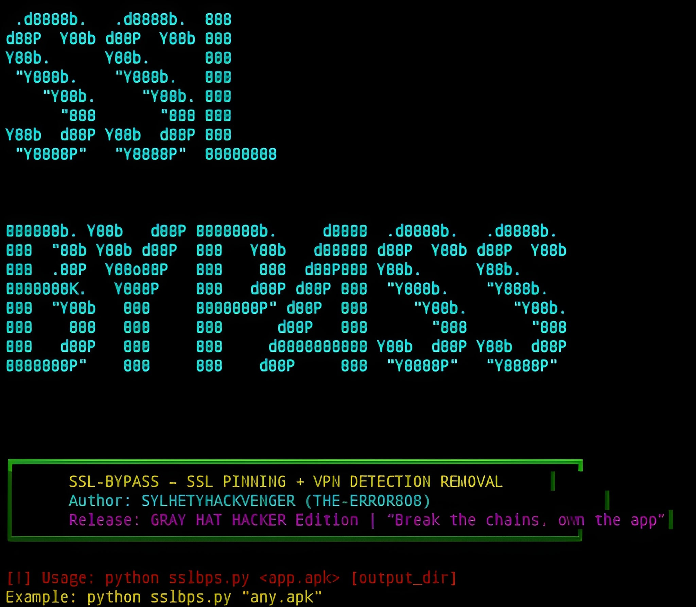

  

<h1 align="center">⚡ SSLBPS Research Framework ⚡</h1>

Android Application Security Research • Static Analysis • Educational Reverse Engineering

---

🧠 Overview

SSLBPS is an Android security research project designed to help researchers better understand application architecture, APK structure, Android manifests, Smali code organization, certificate trust models, and common mobile security controls.

The project focuses on educational analysis, defensive research, software auditing, and Android application security learning. It demonstrates concepts frequently discussed in mobile application testing, secure development, code review, and reverse-engineering education.

---

🔬 Research Areas

🛡️ Android Security Architecture

📱 APK Structure Analysis

🔍 Manifest Inspection

⚙️ Smali Code Exploration

📜 Certificate Trust Models

🌐 Network Security Configuration Concepts

🧩 Application Rebuilding Workflows

📊 Mobile Security Research

---

🚀 Features

✓ Android Package Analysis

✓ Manifest Processing

✓ Automated Research Workflow

✓ Security Configuration Inspection

✓ Smali File Analysis

✓ Cross-Platform Support

✓ Terminal-Based Interface

✓ Educational Security Research

---

⚠️ Disclaimer

This repository is intended solely for authorized security research, education, software auditing, and applications you own or have explicit permission to analyze. Users are responsible for complying with applicable laws, regulations, licenses, and organizational policies.

---

SYSTEM STATUS      : ONLINE
RESEARCH MODE      : ACTIVE
ANDROID ANALYSIS   : READY
OPERATOR           : SYLHETYHACKVENGER
FRAMEWORK          : SSLBPS

